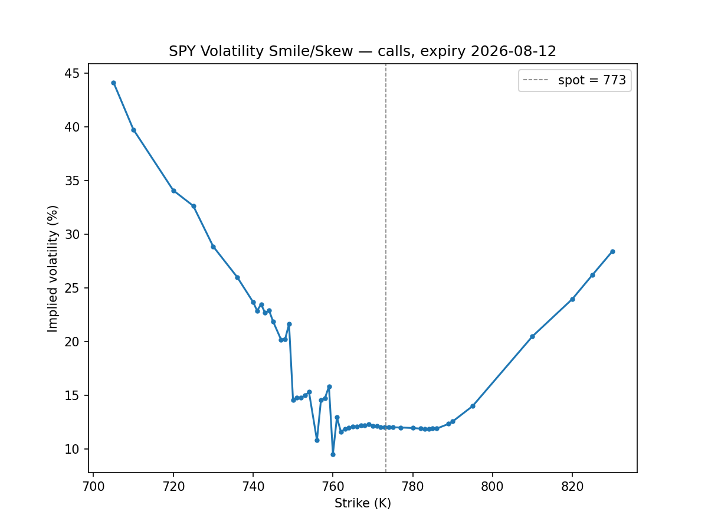
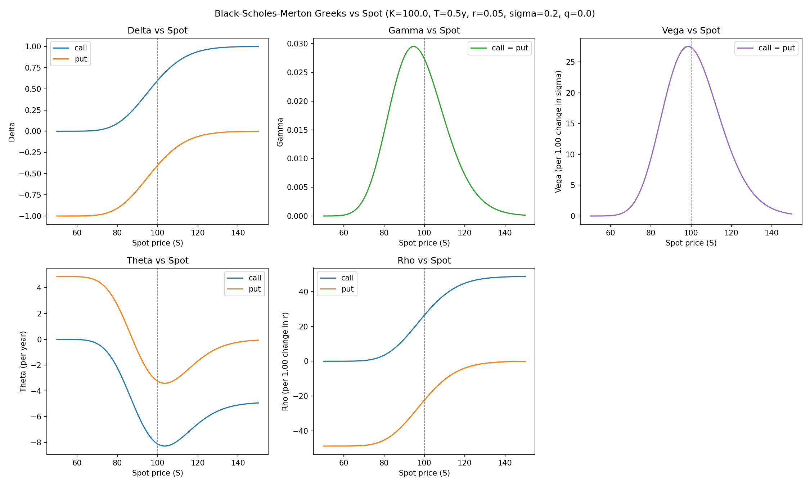
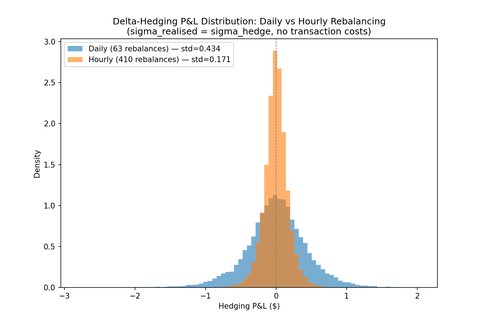
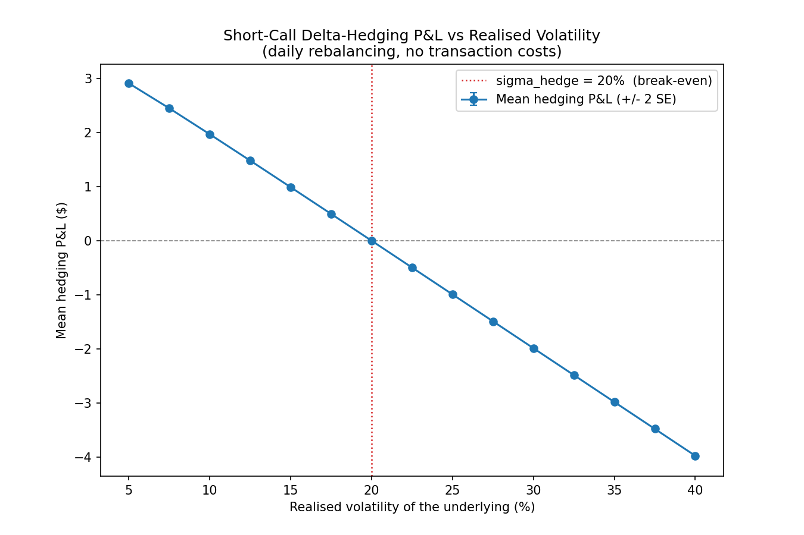
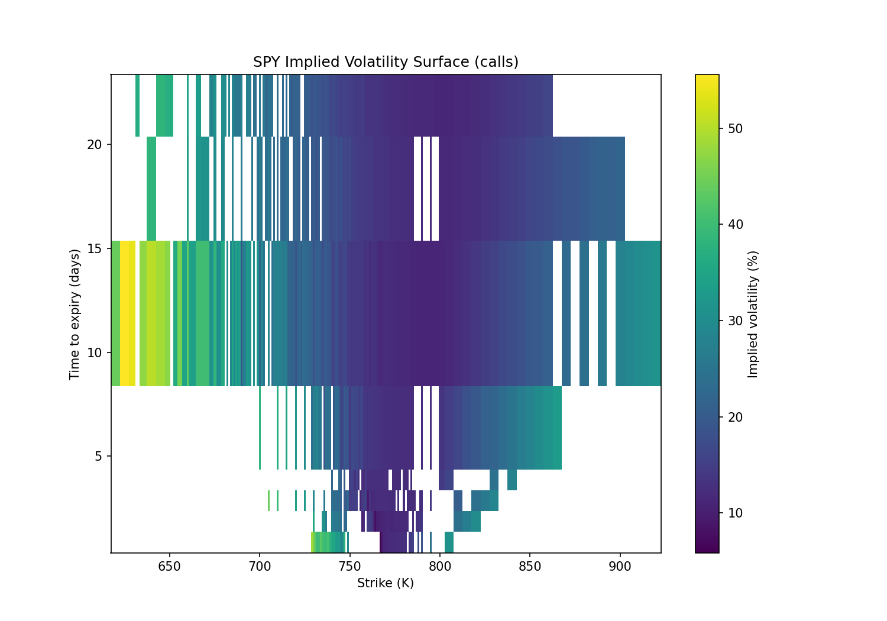

# options-pricer

A Black-Scholes-Merton options pricing and risk engine built from first principles in
Python — no third-party options pricing library (QuantLib, py_vollib, mibian) is used
anywhere in the pricing code itself. I built this to *learn* options theory from the
ground up (I came in with strong Python/pandas/numpy from a data analytics background,
but no formal derivatives training) as a portfolio project for quant trading graduate
applications: every pricing formula, Greek, and simulation here is derived and coded by
hand, cross-checked against textbook references and an independent library in tests
only, then used to run real experiments against live SPY options data.

**What it does:** closed-form Black-Scholes-Merton pricing and Greeks (vectorised over
numpy arrays) → a Newton-Raphson/Brent implied volatility solver → a live SPY
option-chain pipeline (yfinance) that builds an actual volatility smile and term
structure → a Monte Carlo discrete delta-hedging simulator that reproduces the
textbook gamma-vs-vega P&L relationship a market maker actually trades on.

## Results

**Volatility smile (SPY, live data)** — implied vol vs strike shows the market pricing
in a fatter left tail than Black-Scholes' lognormal assumption allows: OTM puts trade
at a persistent premium over ATM.



**The five Greeks vs spot price** — delta/theta/rho differ for calls vs puts; gamma and
vega are provably identical between them (see [greeks.py](src/options_pricer/greeks.py)).



**Discrete delta-hedging P&L, daily vs hourly rebalancing** — more frequent hedging
tightens the P&L distribution around zero (std drops from 0.43 to 0.17 across a 6.5x
increase in rebalances), which is the discrete-hedging-error term shrinking as
1/√(rebalances).



**The core market-making intuition: realised vol vs. the vol you hedged at** — a
short-call position delta-hedged at `sigma_hedge=20%` is profitable when the underlying's
*realised* volatility comes in below 20%, and loses money above it, crossing zero
almost exactly at the break-even. This is gamma P&L: a short-gamma position bleeds from
convexity if the world moves more than you were paid (via theta) to expect.



**Live SPY implied volatility surface** — strike x time-to-expiry, built entirely from
a same-day option chain fetch, cleaned, and inverted contract-by-contract.



More plots (Greeks across multiple expiries, transaction-cost-vs-rebalance-frequency
tradeoffs, ATM term structure) are generated into `plots/` — see
[Setup](#setup--run) below to regenerate all of them, or open
[notebooks/walkthrough.ipynb](notebooks/walkthrough.ipynb) for the full narrative
end to end.

## What I learned

- **The smile isn't a bug in Black-Scholes, it's the point.** The model's single-`sigma`
  assumption is empirically false (real implied vol varies by strike), but the model
  survives as a *quoting convention* — the industry converts prices to/from implied vol
  precisely because it gives everyone a shared, comparable coordinate system across
  strikes and expiries, not because anyone believes the lognormal assumption literally.
- **Delta-hedging P&L is a gamma trade, not a direction trade.** Once I actually
  simulated it (rather than just reading about it), the mechanism clicked: a
  delta-hedged short option's P&L is driven by `-0.5 * Gamma * S^2 * (sigma_realised^2 -
  sigma_hedge^2) * dt`, integrated over the option's life. I validated this numerically
  in [test_hedging.py](tests/test_hedging.py) by comparing simulated P&L against that
  closed-form gamma integral — they agree to within a few Monte Carlo standard errors.
- **Deep ITM/OTM implied vol is inherently ill-conditioned, not a solver weakness.**
  When vega collapses to ~1e-6, a price agreement within 1e-8 only pins volatility down
  to about `tol/vega`, i.e. a huge range — which is exactly why real deep-ITM/OTM
  quotes are noisy in practice. I hit this directly while testing the implied vol
  solver and had to give that specific test case a much looser tolerance, with a
  comment explaining why (see `test_convergence_deep_itm_within_ill_conditioned_tolerance`
  in [test_implied_vol.py](tests/test_implied_vol.py)).
- **"Pin your dependencies" is not optional, and pinning isn't a one-time act.**
  `yfinance==0.2.43`, my original pin, silently broke against a Yahoo API change
  mid-project. Separately, while polishing this repo, I discovered `requirements.txt`'s
  other pins (`matplotlib==3.9.1` etc.) no longer had prebuilt wheels available and
  failed to install on a clean machine. I only caught this by actually testing
  `pip install -r requirements.txt` in a genuinely fresh virtual environment instead of
  assuming it worked — a habit I'm keeping.

## Repo structure

```
src/options_pricer/
    black_scholes.py   # BSM pricing, d1/d2 (vectorised)
    greeks.py           # delta, gamma, vega, theta, rho + generic finite-difference cross-check
    implied_vol.py       # Newton-Raphson w/ Brent fallback
    data.py               # live SPY option chain (yfinance): fetch, clean, r/q lookup
    hedging.py             # GBM path simulation + discrete delta-hedging P&L
tests/                       # pytest, one file per module, incl. independent py_vollib cross-check
scripts/                       # plot-generating entry points (not pure functions, so kept out of src/)
notebooks/walkthrough.ipynb      # narrative end-to-end walkthrough with embedded output
plots/                             # generated PNGs (150dpi) - reproducible, gitignored
assets/readme/                       # curated copies of the plots embedded above (committed)
```

See [CLAUDE.md](CLAUDE.md) for the coding/testing rules this repo follows (pure functions,
one test per pricing/risk function against a known-good reference, no third-party pricing
libraries in `src/`, etc).

## Setup & run

Verified end-to-end in a clean virtual environment:

```bash
git clone https://github.com/Saini-code/options-pricer.git
cd options-pricer
python -m venv .venv
.venv/Scripts/activate        # Windows; use `source .venv/bin/activate` on macOS/Linux
pip install -r requirements-dev.txt   # includes requirements.txt + py_vollib for the test cross-check
pytest                                 # 81 tests, ~10s
```

Regenerate the plots (the live-data script needs network access to Yahoo Finance):

```bash
python scripts/generate_greek_plots.py
python scripts/generate_hedging_plots.py
python scripts/generate_vol_surface_plots.py   # fetches live SPY data
```

## Testing

```bash
pytest --cov=options_pricer --cov-report=term-missing
```

81 tests, all passing. Coverage is **100% on every pure pricing/risk module**
(`black_scholes.py`, `greeks.py`, `hedging.py`), **92% on `implied_vol.py`** (the
uncovered lines are defensive fallback branches that are difficult to trigger without
mocking scipy internals), and **49% on `data.py`** — by design: `data.py`'s
network-calling functions (`fetch_option_chain`, `get_risk_free_rate`, etc.) are
exercised manually against live Yahoo Finance data via `scripts/generate_vol_surface_plots.py`
rather than in the automated suite; the pure transform function it feeds
(`clean_option_chain`) is unit-tested against synthetic data and *is* fully covered.

## Limitations

Being upfront about what this is and isn't:

- **European exercise only.** No American early-exercise, no binomial/trinomial tree,
  no Longstaff-Schwartz. Early exercise is economically irrelevant for the pricing math
  here but is a real limitation for, e.g., single-name equity options with dividends.
- **Geometric Brownian motion, constant volatility.** The entire pricing and hedging
  simulation assumes GBM with a single constant `sigma` — no stochastic volatility
  (Heston, SABR), no jumps, no local volatility surface. The vol smile this repo
  *measures* from real data is direct empirical evidence that this assumption is wrong;
  the repo doesn't yet contain a model that fixes it.
- **Day-count convention is inconsistent, deliberately left visible rather than
  papered over.** `data.py` annualises time-to-expiry using 365 calendar days
  (correct for discounting); `scripts/generate_hedging_plots.py` annualises
  rebalance-frequency using 252 trading days (the standard convention for a
  volatility calibrated from daily bars). Both are individually standard for what
  they're used for, but mixing them without reconciling is an easy-to-miss source of
  small systematic error - see the comment in that script for detail.
- **Data quality, live SPY pipeline:** ~7% of cleaned contracts fail to produce an
  implied vol on a typical run because their bid-ask mid price sits slightly below the
  no-arbitrage intrinsic-value floor — concentrated in thinly-traded, very short-dated,
  deep-ITM contracts with stale quotes. `get_dividend_yield`'s percentage-point vs.
  decimal rescaling is based on one empirically observed API response, not documented
  Yahoo behavior, and is only defensively guarded, not guaranteed correct if Yahoo
  changes convention again. `get_risk_free_rate` uses a T-bill *discount* yield as a
  stand-in for a continuously-compounded rate, a standard but not exact simplification.
- **Transaction cost and hedging-frequency experiments use illustrative constants**
  (e.g. `risk_aversion=2.0` in the risk-adjusted objective) chosen to make the tradeoff
  visible in a plot, not calibrated to any real risk preference or venue's actual cost
  schedule.
- **No portfolio-level risk aggregation.** Everything here prices and hedges a single
  option in isolation; there's no cross-Greek netting, no correlation, no VaR.
